# [굿잡 (GoodJob)] 데이터베이스 설계서 및 ERD 명세서 (엔터프라이즈 B2B & 컴플라이언스 분산 아키텍처)

## 1. 데이터베이스 구축 개요 및 설계 원칙

* **구축 목적**: 
  - 클라이언트 로컬스토리지의 한계를 탈피하고, **모든 사용자가 실시간으로 글, 댓글, 공고, 스크랩을 공유할 수 있는 중앙 서버 데이터베이스** 구축.
  - **B2B 엔터프라이즈 확장**: 중앙 기업 마스터(`companies`) 테이블 및 **다중 HR 관리자(Multi-admin)** 체계를 구축하여 법인 단위 채용 브랜딩 및 과금 정합성 보장.
  - **B2B ATS 불변 감사 원장(Audit Trail) 구축**: 현재 전형 단계 스냅샷(`candidate_applications`)과 별도로 상태 변경 이력 원장 **`application_history`**를 구축하여 다중 HR 변경 책임 소재 추적, 채용 퍼널 리드타임(Lead Time) 분석, 채용 수수료 과금 분쟁 원천 방어.
  - **글로벌 개인정보보호(GDPR/PIPA) 준수**: `users` 및 `resume_profiles`의 **논리적 삭제(`deleted_at`)** 컬럼 및 30일 유예 후 영구 파기(Hard Delete) 배치 파이프라인 명세화.
  - **채용 브랜딩 방어 및 리뷰 공식 소명(Dispute)**: 악의적 허위 리뷰에 대응하는 HR 공식 답변(`official_reply`) 및 소명 중재 워크플로우 지원.
  - **현업 맞춤형 ATS 파이프라인 세분화**: 자진 포기 및 면접 노쇼를 명확히 추적하는 **`WITHDRAWN`** 상태 도입으로 퍼널 분석 및 리워드 과금 분쟁 차단.
  - **게시일(`posted_at`)과 마감일(`deadline_at`)의 완전한 분리 적재** 및 파생 데이터의 물리 컬럼 배제를 통한 **실시간 데이터 무결성 100% 보장**.
  - **수집 일시의 역할 분리**: 단일 통합 공고 카드(`job_postings`)에 대해 **최초 발견일(`first_crawled_at`)**과 **최종 갱신일(`last_updated_at`)**을 분리하여 시차를 둔 다채널 공고 병합 로직의 정합성을 보장.
  - **OAuth 다중 식별자 충돌 방지 및 고속 라우팅**: `(oauth_provider, oauth_provider_id)` 복합 유니크 제약과 `(email, oauth_provider)` 복합 인덱스를 적용하여 소셜 충돌 방지 및 0.1ms 라우팅 보장.
  - **유료 크레딧 불변 원장(Immutable Ledger) 구축**: 최종 잔액(`user_credits`) 외에 모든 충전·사용·환불 이력을 추적하는 `credit_transactions` 테이블을 신설하여 금융·결제 분쟁 원천 차단.
  - **기술 스택 정규화 매핑 테이블(`user_skills`, `job_tags`) 분리**와 **PostgreSQL JSONB/GIN 인덱스 지원**을 통해 대용량 동적 AI 역량 매칭 쿼리 병목 원천 해소.
  - **수집 출처(`crawled_origins`)의 유니크 제약** 및 **이벤트 브로커(Kafka/Redpanda) 오프셋 추적 키** 도입으로 분산 파이프라인 멱등성(Idempotency) 보장.
  - **고트래픽 행 잠금(Row Lock) 방어**: 커뮤니티 및 공고 카드의 조회수(`view_count`), 좋아요(`likes_count`)에 대해 **Redis Write-Back 인메모리 버퍼링 및 배치 동기화 아키텍처** 명세화.
* **지원 DBMS**: 
  - **SQLite 3**: 로컬 개발, 신속한 프로토타이핑, 오프라인 테스트용 고속 임베디드 RDBMS
  - **PostgreSQL 15+**: 상용 엔터프라이즈 운영 환경(JSONB, GIN 인덱스, 고성능 파티셔닝 지원)
* **데이터 무결성 핵심 원칙 (신뢰성 최우선)**:
  1. **파생 데이터(Derived Data) 물리 컬럼 완전 배제**: 마감 여부(`is_expired`)나 잔여 일수(`deadline_days_left`)를 물리 테이블 컬럼으로 저장하지 않고, 실시간 뷰(`v_active_job_postings`)를 통해 동적으로 산출하여 정합성 훼손 원천 차단.
  2. **재무/이력 데이터 이중 검증 (원장 일치성)**: 유료 크레딧은 `credit_transactions`, 지원자 상태는 `application_history` 불변 원장과 100% 일치하도록 단일 트랜잭션 내 다중 적재 강제.
  3. **허위/하드코딩 카운트 배제**: 게시글 댓글 수(`comments_count`), 리뷰 수는 별도 조작된 정적 컬럼 대신 연관 테이블의 실제 `COUNT(*)` 뷰와 1:1 완벽 일치 강제.
  4. **외래키 제약조건(Foreign Key Constraint)** 활성화 및 `ON DELETE CASCADE / SET NULL` 명확화.
  5. **수집 원본 중복 적재 원천 차단**: `crawled_origins (source_platform, origin_url)` 복합 유니크 제약으로 크롤러 재시도 시에도 데이터 중복 오염 방지.

---

## 2. Mermaid Entity-Relationship Diagram (ERD)

```mermaid
erDiagram
    COMPANIES ||--o{ USERS : "1:N 다중 HR 관리자"
    COMPANIES ||--o{ JOB_POSTINGS : "1:N 소유 공고"
    COMPANIES ||--o{ COMPANY_CLAIMS : "1:N 소유권 인증 신청"

    USERS ||--o| RESUME_PROFILES : "1:1 소유"
    USERS ||--o{ USER_SKILLS : "1:N 보유 기술 스택"
    USERS ||--o{ BOOKMARKS : "1:N 스크랩"
    USERS ||--o{ COMPANY_REVIEWS : "1:N 현직자 리뷰 작성"
    USERS ||--o{ COMMUNITY_POSTS : "1:N 작성"
    USERS ||--o{ COMMUNITY_COMMENTS : "1:N 작성"
    USERS ||--o{ COMMUNITY_REPORTS : "1:N 신고 제출"
    USERS ||--o{ CANDIDATE_APPLICATIONS : "1:N 지원/클릭 이력"
    USERS ||--o{ CANDIDATE_REWARDS : "1:N 합격축하금(50만) 신청"
    USERS ||--o| USER_CREDITS : "1:1 크레딧 잔액"
    USERS ||--o{ CREDIT_TRANSACTIONS : "1:N 크레딧 원장 이력"
    USERS ||--o{ APPLICATION_HISTORY : "1:N 전형 변경 HR 담당자"

    JOB_POSTINGS ||--o{ JOB_TAGS : "1:N 요구 기술 태그"
    JOB_POSTINGS ||--o{ CRAWLED_ORIGINS : "1:N 원본 출처 병합 (UNIQUE 보장)"
    JOB_POSTINGS ||--o{ BOOKMARKS : "1:N 즐겨찾기 대상"
    JOB_POSTINGS ||--o{ COMPANY_REVIEWS : "1:N 선배 리뷰"
    JOB_POSTINGS ||--o{ COMPANY_CLAIMS : "1:N 기업 소유권 인증"
    JOB_POSTINGS ||--o{ CANDIDATE_APPLICATIONS : "1:N 지원자 관리"
    JOB_POSTINGS ||--o{ CANDIDATE_REWARDS : "1:N 합격 리워드"

    CANDIDATE_APPLICATIONS ||--o{ APPLICATION_HISTORY : "1:N 전형 단계 변경 불변 이력"

    COMMUNITY_POSTS ||--o{ COMMUNITY_COMMENTS : "1:N 실제 댓글 (COUNT 일치)"
    COMMUNITY_POSTS ||--o{ COMMUNITY_REPORTS : "1:N 신고 누적 (5회 블라인드)"

    CRAWLER_RUN_LOGS ||--o{ JOB_POSTINGS : "수집 이력 감사"
    CRAWLER_CIRCUIT_BREAKERS ||--o{ CRAWLER_RUN_LOGS : "장애 차단 관제"

    COMPANIES {
        text id PK "기업 마스터 고유 UUID"
        text name "대표 법인/기업명"
        text biz_reg_number "사업자등록번호 (UNIQUE)"
        text corporate_domain "공식 도메인 (toss.im 등)"
        text logo_url "공식 브랜드 로고 URL"
        text website_url "공식 웹사이트 URL"
        text description "기업 소개 및 브랜딩"
        text industry "산업군 구분"
        integer is_claimed "소유권 인증 여부 (1/0)"
        datetime created_at "등록 일시"
    }

    USERS {
        text id PK "사용자 고유 UUID"
        text company_id FK "소속 기업 ID (HR 관리자용)"
        text email "이메일 주소"
        text name "이름/닉네임"
        text avatar_url "프로필 아바타 URL"
        text oauth_provider "google / naver / kakao / direct"
        text oauth_provider_id "OAuth 제공자 고유 식별자 (sub/id)"
        text role "USER / ENTERPRISE / ADMIN"
        integer is_active "계정 활성 여부 (1/0)"
        datetime deleted_at "탈퇴 일시 (논리적 삭제)"
        datetime created_at "가입 일시"
    }

    RESUME_PROFILES {
        text id PK "스펙 프로필 ID"
        text user_id FK "소유자 사용자 ID (UNIQUE)"
        text target_role "frontend / backend / data / fullstack"
        text preferred_location "희망 근무 지역"
        text experience_type "신입 / 경력"
        text github_url "GitHub 프로필/저장소 링크"
        text blog_url "기술 블로그 링크"
        text resume_file_url "PDF 이력서 원본 URL"
        text parsed_resume_json "AI 자동 파싱 스펙 JSON"
        datetime deleted_at "삭제 일시 (GDPR/PIPA 파기 추적)"
        datetime updated_at "최종 갱신 일시"
    }

    USER_SKILLS {
        text id PK "스킬 매핑 ID"
        text user_id FK "구직자 사용자 ID"
        text skill_name "기술 스택명 (React, TypeScript 등)"
        integer proficiency_level "숙련도 (1~5)"
        datetime created_at "등록 일시"
    }

    JOB_POSTINGS {
        text id PK "굿잡 단일 공고 고유 ID"
        text company_id FK "기업 마스터 ID (매칭 시)"
        text company_name "정규화된 대표 기업명"
        text company_raw "수집 원본 기업명"
        text company_logo "브랜드 SVG 데이터 URI"
        text title "채용 공고 제목"
        text experience_level "경력 조건"
        text location "근무지"
        text salary "급여 조건"
        datetime posted_at "원문 공고 게시일/등록일 (최신순 인덱스)"
        datetime deadline_at "원문 공고 마감일/종료일 (마감임박 인덱스)"
        text deadline_text "마감 표시 텍스트"
        datetime first_crawled_at "최초 시스템 발견 일시"
        datetime last_updated_at "최종 정보 갱신 일시"
        text source_type "CRAWLED / DIRECT_HIRE"
        integer is_claimed "기업 직접 인증 여부"
        integer is_remote "풀 리모트 (100% 재택근무)"
        integer is_flexible_work "유연근무 / 주 4.5일제"
        integer is_military_service "병역특례 지정업체"
        text summary_mission "굿잡 AI 미션 요약"
        text summary_requirements "굿잡 AI 요건 요약"
        text summary_benefits "굿잡 AI 복지 요약"
        text keyword_highlights "핵심 키워드 3선 JSON"
        datetime kafka_published_at "이벤트 브로커 발행 일시"
        integer kafka_offset "브로커 파티션 오프셋 (추적용)"
        integer view_count "실제 조회수 (Redis Write-Back)"
        integer scrap_count "실제 스크랩수"
        integer is_active "공시 활성 상태"
        datetime created_at "시스템 적재 일시"
    }

    JOB_TAGS {
        text id PK "태그 매핑 ID"
        text job_posting_id FK "채용 공고 ID"
        text tag_name "기술 태그명 (React, Node.js, Python 등)"
        integer is_primary "주요 필수 스택 여부 (1/0)"
    }

    CRAWLED_ORIGINS {
        text id PK "수집 출처 ID"
        text job_posting_id FK "연결된 굿잡 단일 공고 ID"
        text source_platform "saramin, jobkorea, wanted 등"
        text origin_url "원문 URL (UNIQUE 복합키)"
        datetime platform_posted_at "원본 플랫폼 등록일"
        datetime platform_deadline_at "원본 플랫폼 마감일"
        datetime kafka_published_at "이벤트 브로커 발행 일시"
        integer kafka_offset "브로커 파티션 오프셋"
        datetime crawled_at "수집 일시"
    }

    COMPANY_REVIEWS {
        text id PK "리뷰 ID"
        text job_posting_id FK "대상 공고 ID"
        text user_id FK "작성자 회원 ID (외부수집은 NULL)"
        text author_verified_org "인증 재직 소속명"
        text author_role "직무 (예: 프론트엔드)"
        text tenure_years "근속 연수 (예: 2년차)"
        real rating "평점 (1.0~5.0)"
        text content "선배 현직자 꿀팁 리뷰 본문"
        integer likes "좋아요 수"
        text official_reply "기업 HR 공식 답변/소명 내용"
        text official_reply_by FK "답변 작성 HR 계정"
        datetime official_replied_at "공식 답변 등록 일시"
        integer is_disputed "기업 공식 이의제기 접수 여부"
        text dispute_reason "소명 및 이의제기 사유"
        text dispute_status "NONE / REQUESTED / ACCEPTED_BLINDED / REJECTED"
        datetime created_at "작성 일시"
    }

    USER_CREDITS {
        text id PK "크레딧 계좌 ID"
        text user_id FK "사용자 ID (UNIQUE)"
        integer balance "최종 잔액 (원장과 1:1 정합)"
        datetime updated_at "최종 갱신 일시"
    }

    CREDIT_TRANSACTIONS {
        text id PK "트랜잭션 고유 ID"
        text user_id FK "사용자 ID"
        text transaction_type "CHARGE / USE / REFUND / REWARD_BONUS"
        integer amount "증감 금액 (+충전/-사용)"
        integer balance_after "거래 후 잔액"
        text service_type "사용/충전 서비스 구분"
        text order_id "결제사 PG 주문번호 / 서비스 연동키"
        text description "상세 거래 내역 요약"
        datetime created_at "거래 발생 일시"
    }

    COMPANY_CLAIMS {
        text id PK "인증 신청 ID"
        text company_id FK "대상 기업 마스터 ID"
        text job_posting_id FK "대상 공고 ID"
        text company_name "기업명"
        text biz_reg_number "사업자등록번호 (포털메일 신청 시 필수)"
        text applicant_email "신청 이메일 (@company.com)"
        integer is_auto_approved "도메인 일치 무심사 즉시 승인 여부"
        text verification_code "6자리 이메일 인증코드"
        text status "PENDING / APPROVED / REJECTED"
        text rejection_reason "반려 사유"
        datetime applied_at "신청 일시 (상태 복합 인덱스)"
        datetime reviewed_at "승인/반려 일시"
    }

    CANDIDATE_APPLICATIONS {
        text id PK "지원자 이력 ID"
        text job_posting_id FK "대상 공고 ID"
        text user_id FK "지원 구직자 ID"
        text application_type "OUTLINK_CLICK / DIRECT_ATS"
        text current_stage "APPLIED / DOC_PASS / INTERVIEW / FINAL_OFFER / REJECTED / WITHDRAWN"
        text withdrawal_reason "자진 포기 / 노쇼 사유"
        datetime created_at "지원 일시"
        datetime updated_at "최종 상태 변경 일시"
    }

    APPLICATION_HISTORY {
        text id PK "이력 고유 UUID"
        text application_id FK "대상 지원 이력 ID"
        text from_stage "변경 전 전형 단계"
        text to_stage "변경 후 전형 단계"
        text changed_by FK "상태를 변경한 HR 담당자 ID"
        text change_reason "단계 변경 상세 사유"
        datetime created_at "변경 일시"
    }

    CANDIDATE_REWARDS {
        text id PK "리워드 신청 ID"
        text user_id FK "구직자 사용자 ID"
        text job_posting_id FK "합격 공고 ID"
        integer reward_amount "축하금 (500,000원)"
        text proof_doc_type "HEALTH_INSURANCE_CERT (정부24)"
        text proof_doc_url "건강보험자격득실확인서 URL"
        text bank_name "입금 은행명"
        text bank_account "계좌번호"
        datetime employed_at "실제 입사일"
        integer one_month_verified "입사 1개월 재직 확인 (Clawback 방어)"
        text status "PENDING / APPROVED / PAID / REJECTED"
        integer enterprise_fee_billed "기업 채용수수료 청구 여부"
        integer enterprise_fee_amount "기업 청구 금액"
        datetime applied_at "신청 일시 (상태 복합 인덱스)"
        datetime paid_at "지급 완료 일시"
    }

    COMMUNITY_POSTS {
        text id PK "게시글 ID"
        text user_id FK "작성자 ID"
        text author_nickname "익명 닉네임"
        text category "interview / company_blind / talk / transfer_lounge"
        text title "게시글 제목"
        text content "게시글 본문"
        integer view_count "조회수 (Redis Write-Back)"
        integer likes_count "좋아요 수 (Redis Write-Back)"
        integer report_count "누적 신고 건수"
        integer is_blinded "신고 5회 누적 시 자동 블라인드"
        datetime created_at "작성 일시"
    }

    COMMUNITY_COMMENTS {
        text id PK "댓글 ID"
        text post_id FK "대상 게시글 ID"
        text user_id FK "작성자 ID"
        text author_nickname "익명 닉네임"
        text content "댓글 본문"
        integer likes_count "좋아요 수 (Redis Write-Back)"
        integer report_count "누적 신고 건수"
        integer is_blinded "신고 5회 누적 시 자동 블라인드"
        datetime created_at "작성 일시"
    }

    COMMUNITY_REPORTS {
        text id PK "신고 ID"
        text user_id FK "신고자 ID (중복 신고 방지 UNIQUE)"
        text target_type "POST / COMMENT"
        text target_id "게시글/댓글 ID"
        text reason "SPAM / ABUSE / PROMOTION / INAPPROPRIATE"
        datetime created_at "신고 일시"
    }

    CRAWLER_CIRCUIT_BREAKERS {
        text platform PK "채널명 (saramin, wanted 등)"
        text status "CLOSED(정상) / OPEN(차단)"
        real error_rate_10m "최근 10분 에러율 (%)"
        integer consecutive_errors "연속 에러 수"
        datetime tripped_at "차단 일시"
        datetime resumed_at "복구 일시"
    }
```



---

## 3. 실제 구동 DDL 명세 (SQLite & PostgreSQL 호환)

```sql
-- 외래키 제약 활성화 (SQLite 환경 필수)
PRAGMA foreign_keys = ON;

-- ============================================================================
-- 1. B2B 기업 마스터 테이블 (다중 HR 관리자 및 법인 통합 관리)
-- ============================================================================

CREATE TABLE IF NOT EXISTS companies (
    id TEXT PRIMARY KEY,
    name TEXT NOT NULL,                  -- 대표 법인명/기업명
    biz_reg_number TEXT UNIQUE,          -- 사업자등록번호 (Claim 완료 시 등록)
    corporate_domain TEXT,               -- 공식 도메인 (예: toss.im, navercorp.com)
    logo_url TEXT,                       -- 브랜드 공식 로고 이미지 URL
    website_url TEXT,                    -- 공식 웹사이트
    description TEXT,                    -- 기업 소개 및 브랜딩 문구
    industry TEXT,                       -- 산업군 분류
    is_claimed INTEGER DEFAULT 0,        -- 1: 소유권 인증 완료
    created_at DATETIME DEFAULT CURRENT_TIMESTAMP
);

CREATE INDEX IF NOT EXISTS idx_companies_domain ON companies (corporate_domain);

-- ============================================================================
-- 2. 사용자 및 계정 관리 테이블 (GDPR/PIPA 논리적 삭제 및 Multi-admin HR 연동)
-- ============================================================================

CREATE TABLE IF NOT EXISTS users (
    id TEXT PRIMARY KEY,
    company_id TEXT REFERENCES companies(id) ON DELETE SET NULL, -- ENTERPRISE 계정의 소속 기업 매핑
    email TEXT NOT NULL,                  -- 동일 이메일 다중 소셜 로그인 허용 (UNIQUE 제거)
    name TEXT NOT NULL,
    avatar_url TEXT,
    oauth_provider TEXT NOT NULL CHECK (oauth_provider IN ('google', 'naver', 'kakao', 'direct')),
    oauth_provider_id TEXT NOT NULL,     -- OAuth 제공자가 발급한 고유 회원 식별자 (sub, id 등)
    role TEXT DEFAULT 'USER' CHECK (role IN ('USER', 'ENTERPRISE', 'ADMIN')),
    is_active INTEGER DEFAULT 1,          -- 1: 활성 회원, 0: 탈퇴 회원
    deleted_at DATETIME,                  -- 탈퇴 일시 (논리적 삭제: GDPR/PIPA 파기 추적)
    created_at DATETIME DEFAULT CURRENT_TIMESTAMP,
    CONSTRAINT uq_user_oauth UNIQUE (oauth_provider, oauth_provider_id)
);

-- 동일 이메일 가입 계정 및 특정 소셜 제공자 연동 여부를 즉시 판별하는 복합 인덱스 (0.1ms 라우팅)
CREATE INDEX IF NOT EXISTS idx_users_email_provider ON users (email, oauth_provider);

-- 사용자 스펙 프로필 (개인정보 논리적 삭제 컬럼 포함)
CREATE TABLE IF NOT EXISTS resume_profiles (
    id TEXT PRIMARY KEY,
    user_id TEXT UNIQUE NOT NULL REFERENCES users(id) ON DELETE CASCADE,
    target_role TEXT NOT NULL DEFAULT 'frontend',
    preferred_location TEXT DEFAULT '서울/수도권',
    experience_type TEXT DEFAULT '신입',
    github_url TEXT,
    blog_url TEXT,
    resume_file_url TEXT,
    parsed_resume_json TEXT DEFAULT '{}',
    deleted_at DATETIME,                  -- 구직자 이력서 논리적 삭제 일시
    updated_at DATETIME DEFAULT CURRENT_TIMESTAMP
);

-- 사용자 보유 기술스택 매핑 테이블 (정규화: 다중 스택 고속 매칭용)
CREATE TABLE IF NOT EXISTS user_skills (
    id TEXT PRIMARY KEY,
    user_id TEXT NOT NULL REFERENCES users(id) ON DELETE CASCADE,
    skill_name TEXT NOT NULL,
    proficiency_level INTEGER DEFAULT 3, -- 1~5 척도
    created_at DATETIME DEFAULT CURRENT_TIMESTAMP,
    UNIQUE (user_id, skill_name)
);

-- ============================================================================
-- 3. 채용 공고 메인 및 연관 매핑 테이블 (기업 마스터 및 수집/갱신 일시 분리)
-- ============================================================================

CREATE TABLE IF NOT EXISTS job_postings (
    id TEXT PRIMARY KEY,
    company_id TEXT REFERENCES companies(id) ON DELETE SET NULL, -- 소유 기업 마스터 외래키
    company_name TEXT NOT NULL,
    company_raw TEXT NOT NULL,
    company_logo TEXT NOT NULL,
    title TEXT NOT NULL,
    experience_level TEXT DEFAULT '신입/경력무관',
    location TEXT DEFAULT '전국',
    salary TEXT DEFAULT '회사내규에 따름',
    posted_at DATETIME NOT NULL,          -- 원문 공고 등록일 (최신순 정렬 기준)
    deadline_at DATETIME NOT NULL,        -- 원문 공고 마감일 (마감임박순 정렬 기준)
    deadline_text TEXT NOT NULL,          -- 화면 표시용 텍스트 (예: 🔥 오늘 23:59 마감!)
    first_crawled_at DATETIME NOT NULL,   -- 최초 시스템 발견/적재 일시
    last_updated_at DATETIME NOT NULL,    -- 다채널 변동사항 최종 동기화/갱신 일시
    source_type TEXT DEFAULT 'CRAWLED' CHECK (source_type IN ('CRAWLED', 'DIRECT_HIRE')),
    is_claimed INTEGER DEFAULT 0,         -- 1: 기업 직접 인증 완료(Claimed)
    is_remote INTEGER DEFAULT 0,          -- 1: 풀 리모트 (100% 재택근무)
    is_flexible_work INTEGER DEFAULT 0,   -- 1: 유연근무 / 주 4.5일제
    is_military_service INTEGER DEFAULT 0,-- 1: 병역특례 (산업기능요원/전문연구요원)
    summary_mission TEXT NOT NULL,
    summary_requirements TEXT NOT NULL,
    summary_benefits TEXT NOT NULL,
    keyword_highlights TEXT NOT NULL DEFAULT '[]', -- JSON 배열
    kafka_published_at DATETIME,          -- Kafka 이벤트 브로커 발행 일시
    kafka_offset BIGINT,                  -- 파티션 오프셋 (재처리 추적용)
    view_count INTEGER DEFAULT 0,         -- 조회수 (Redis Write-Back을 통해 주기적 배치 업데이트)
    scrap_count INTEGER DEFAULT 0,
    is_active INTEGER DEFAULT 1,          -- 1: 활성 공고, 0: 관리자 숨김
    created_at DATETIME DEFAULT CURRENT_TIMESTAMP
);

CREATE TABLE IF NOT EXISTS job_tags (
    id TEXT PRIMARY KEY,
    job_posting_id TEXT NOT NULL REFERENCES job_postings(id) ON DELETE CASCADE,
    tag_name TEXT NOT NULL,
    is_primary INTEGER DEFAULT 1,
    UNIQUE (job_posting_id, tag_name)
);

CREATE TABLE IF NOT EXISTS crawled_origins (
    id TEXT PRIMARY KEY,
    job_posting_id TEXT NOT NULL REFERENCES job_postings(id) ON DELETE CASCADE,
    source_platform TEXT NOT NULL,
    origin_url TEXT NOT NULL,
    platform_posted_at DATETIME,
    platform_deadline_at DATETIME,
    kafka_published_at DATETIME,
    kafka_offset BIGINT,
    crawled_at DATETIME DEFAULT CURRENT_TIMESTAMP,
    CONSTRAINT uq_crawled_origins UNIQUE (source_platform, origin_url)
);

-- ============================================================================
-- 4. 선배 현직자 리뷰 & 채용 브랜딩 방어(공식 답변 및 소명 프로세스)
-- ============================================================================

CREATE TABLE IF NOT EXISTS company_reviews (
    id TEXT PRIMARY KEY,
    job_posting_id TEXT NOT NULL REFERENCES job_postings(id) ON DELETE CASCADE,
    user_id TEXT REFERENCES users(id) ON DELETE SET NULL,
    author_verified_org TEXT NOT NULL,
    author_role TEXT NOT NULL,
    tenure_years TEXT DEFAULT '2년차',
    rating REAL DEFAULT 4.5,
    content TEXT NOT NULL,
    likes INTEGER DEFAULT 0,
    official_reply TEXT,                  -- 기업 HR 공식 답변 및 해명 코멘트
    official_reply_by TEXT REFERENCES users(id) ON DELETE SET NULL,
    official_replied_at DATETIME,
    is_disputed INTEGER DEFAULT 0,
    dispute_reason TEXT,
    dispute_status TEXT DEFAULT 'NONE' CHECK (dispute_status IN ('NONE', 'REQUESTED', 'ACCEPTED_BLINDED', 'REJECTED')),
    created_at DATETIME DEFAULT CURRENT_TIMESTAMP
);

-- ============================================================================
-- 5. 유료 크레딧 계좌 및 불변 원장(Ledger) 테이블 (결제 분쟁 방어)
-- ============================================================================

CREATE TABLE IF NOT EXISTS user_credits (
    id TEXT PRIMARY KEY,
    user_id TEXT UNIQUE NOT NULL REFERENCES users(id) ON DELETE CASCADE,
    balance INTEGER DEFAULT 0 CHECK (balance >= 0),
    updated_at DATETIME DEFAULT CURRENT_TIMESTAMP
);

CREATE TABLE IF NOT EXISTS credit_transactions (
    id TEXT PRIMARY KEY,
    user_id TEXT NOT NULL REFERENCES users(id) ON DELETE CASCADE,
    transaction_type TEXT NOT NULL CHECK (transaction_type IN ('CHARGE', 'USE', 'REFUND', 'REWARD_BONUS')),
    amount INTEGER NOT NULL,
    balance_after INTEGER NOT NULL,
    service_type TEXT NOT NULL,
    order_id TEXT,
    description TEXT NOT NULL,
    created_at DATETIME DEFAULT CURRENT_TIMESTAMP
);

CREATE INDEX IF NOT EXISTS idx_credit_transactions_user_time 
ON credit_transactions (user_id, created_at DESC);

-- ============================================================================
-- 6. 기업 인증, ATS 지원자 파이프라인 및 상태 변경 불변 감사 원장
-- ============================================================================

CREATE TABLE IF NOT EXISTS company_claims (
    id TEXT PRIMARY KEY,
    company_id TEXT REFERENCES companies(id) ON DELETE CASCADE,
    job_posting_id TEXT NOT NULL REFERENCES job_postings(id) ON DELETE CASCADE,
    company_name TEXT NOT NULL,
    biz_reg_number TEXT,
    applicant_email TEXT NOT NULL,
    is_auto_approved INTEGER DEFAULT 0,
    verification_code TEXT,
    status TEXT DEFAULT 'PENDING' CHECK (status IN ('PENDING', 'APPROVED', 'REJECTED')),
    rejection_reason TEXT,
    applied_at DATETIME DEFAULT CURRENT_TIMESTAMP,
    reviewed_at DATETIME
);

-- ATS 지원자 현재 상태 스냅샷 테이블
CREATE TABLE IF NOT EXISTS candidate_applications (
    id TEXT PRIMARY KEY,
    job_posting_id TEXT NOT NULL REFERENCES job_postings(id) ON DELETE CASCADE,
    user_id TEXT NOT NULL REFERENCES users(id) ON DELETE CASCADE,
    application_type TEXT DEFAULT 'OUTLINK_CLICK' CHECK (application_type IN ('OUTLINK_CLICK', 'DIRECT_ATS')),
    current_stage TEXT DEFAULT 'APPLIED' CHECK (current_stage IN ('APPLIED', 'DOC_PASS', 'INTERVIEW', 'FINAL_OFFER', 'REJECTED', 'WITHDRAWN')),
    withdrawal_reason TEXT,              -- 자진 포기 / 면접 노쇼 / 타사 합격 사유
    created_at DATETIME DEFAULT CURRENT_TIMESTAMP,
    updated_at DATETIME DEFAULT CURRENT_TIMESTAMP
);

-- ★ 지원자 전형 단계 변경 불변 감사 원장 테이블 (Audit Trail)
-- Multi-admin 책임 소재 분리, 채용 리드타임 통계, 채용 수수료 과금 분쟁 원천 방어
CREATE TABLE IF NOT EXISTS application_history (
    id TEXT PRIMARY KEY,
    application_id TEXT NOT NULL REFERENCES candidate_applications(id) ON DELETE CASCADE,
    from_stage TEXT,                      -- 변경 전 단계 (예: 'DOC_PASS')
    to_stage TEXT NOT NULL,               -- 변경 후 단계 (예: 'INTERVIEW')
    changed_by TEXT REFERENCES users(id) ON DELETE SET NULL, -- 상태를 변경한 HR 담당자 UUID
    change_reason TEXT,                   -- 변경 사유 (예: '1차 실무 면접 합격', '면접 노쇼 자진포기')
    created_at DATETIME DEFAULT CURRENT_TIMESTAMP
);

-- 특정 지원자 타임라인 순차 조회 및 리드타임 분석 인덱스
CREATE INDEX IF NOT EXISTS idx_app_history_timeline 
ON application_history (application_id, created_at ASC);

-- 합격 축하금(50만 원) 신청 및 채용 수수료 정산
CREATE TABLE IF NOT EXISTS candidate_rewards (
    id TEXT PRIMARY KEY,
    user_id TEXT NOT NULL REFERENCES users(id) ON DELETE CASCADE,
    job_posting_id TEXT NOT NULL REFERENCES job_postings(id) ON DELETE CASCADE,
    reward_amount INTEGER DEFAULT 500000,
    proof_doc_type TEXT DEFAULT 'HEALTH_INSURANCE_CERT' CHECK (proof_doc_type IN ('HEALTH_INSURANCE_CERT')),
    proof_doc_url TEXT NOT NULL,
    bank_name TEXT NOT NULL,
    bank_account TEXT NOT NULL,
    employed_at DATETIME NOT NULL,
    one_month_verified INTEGER DEFAULT 0,
    status TEXT DEFAULT 'PENDING' CHECK (status IN ('PENDING', 'APPROVED', 'PAID', 'REJECTED')),
    rejection_reason TEXT,
    enterprise_fee_billed INTEGER DEFAULT 0,
    enterprise_fee_amount INTEGER,
    applied_at DATETIME DEFAULT CURRENT_TIMESTAMP,
    paid_at DATETIME
);

-- ============================================================================
-- 7. 크롤러 관제 및 감사 로그 테이블
-- ============================================================================

CREATE TABLE IF NOT EXISTS crawler_run_logs (
    id TEXT PRIMARY KEY,
    run_timestamp DATETIME NOT NULL,
    batch_trigger TEXT NOT NULL,
    saramin_count INTEGER DEFAULT 0,
    jobkorea_count INTEGER DEFAULT 0,
    wanted_count INTEGER DEFAULT 0,
    jumpit_count INTEGER DEFAULT 0,
    linkedin_count INTEGER DEFAULT 0,
    catch_count INTEGER DEFAULT 0,
    remember_count INTEGER DEFAULT 0,
    raw_total_count INTEGER NOT NULL,
    dedup_merged_count INTEGER NOT NULL,
    new_inserted_count INTEGER NOT NULL,
    expired_count INTEGER DEFAULT 0,
    dedup_rate_percent REAL NOT NULL,
    status TEXT NOT NULL,
    log_summary TEXT
);

CREATE TABLE IF NOT EXISTS crawler_circuit_breakers (
    platform TEXT PRIMARY KEY,
    status TEXT DEFAULT 'CLOSED' CHECK (status IN ('CLOSED', 'OPEN')),
    error_rate_10m REAL DEFAULT 0.0,
    consecutive_errors INTEGER DEFAULT 0,
    tripped_at DATETIME,
    resumed_at DATETIME
);

-- 관리자 경보 발송 채널 테이블 (폐쇄망 사내 메신저 Mattermost/Zulip 웹훅 및 모바일 텔레그램 지원)
CREATE TABLE IF NOT EXISTS admin_alert_channels (
    id TEXT PRIMARY KEY,
    channel_type TEXT NOT NULL CHECK (channel_type IN ('MATTERMOST_WEBHOOK', 'ZULIP_WEBHOOK', 'TELEGRAM_BOT')),
    webhook_url TEXT,                     -- 사내 폐쇄망 Mattermost / Zulip 웹훅 수신 URL
    bot_token TEXT,                       -- 텔레그램 봇 토큰 (TELEGRAM_BOT인 경우)
    chat_id TEXT,                         -- 텔레그램 채팅방/채널 ID
    is_active INTEGER DEFAULT 1,
    alert_on_crawler_fail INTEGER DEFAULT 1,
    alert_on_high_traffic INTEGER DEFAULT 1,
    created_at DATETIME DEFAULT CURRENT_TIMESTAMP
);


-- ============================================================================
-- 8. 커뮤니티, 북마크 테이블
-- ============================================================================

CREATE TABLE IF NOT EXISTS bookmarks (
    id TEXT PRIMARY KEY,
    user_id TEXT NOT NULL REFERENCES users(id) ON DELETE CASCADE,
    job_posting_id TEXT NOT NULL REFERENCES job_postings(id) ON DELETE CASCADE,
    memo TEXT,
    created_at DATETIME DEFAULT CURRENT_TIMESTAMP,
    UNIQUE (user_id, job_posting_id)
);

CREATE TABLE IF NOT EXISTS community_posts (
    id TEXT PRIMARY KEY,
    user_id TEXT REFERENCES users(id) ON DELETE SET NULL,
    author_nickname TEXT NOT NULL,
    author_badge TEXT DEFAULT '취준생',
    category TEXT NOT NULL CHECK (category IN ('interview', 'company_blind', 'talk', 'career_advice', 'transfer_lounge')),
    title TEXT NOT NULL,
    content TEXT NOT NULL,
    view_count INTEGER DEFAULT 0,
    likes_count INTEGER DEFAULT 0,
    report_count INTEGER DEFAULT 0,
    is_blinded INTEGER DEFAULT 0,
    created_at DATETIME DEFAULT CURRENT_TIMESTAMP
);

CREATE TABLE IF NOT EXISTS community_comments (
    id TEXT PRIMARY KEY,
    post_id TEXT NOT NULL REFERENCES community_posts(id) ON DELETE CASCADE,
    user_id TEXT REFERENCES users(id) ON DELETE SET NULL,
    author_nickname TEXT NOT NULL,
    author_badge TEXT DEFAULT '취준생',
    content TEXT NOT NULL,
    likes_count INTEGER DEFAULT 0,
    report_count INTEGER DEFAULT 0,
    is_blinded INTEGER DEFAULT 0,
    created_at DATETIME DEFAULT CURRENT_TIMESTAMP
);

CREATE TABLE IF NOT EXISTS community_reports (
    id TEXT PRIMARY KEY,
    user_id TEXT NOT NULL REFERENCES users(id) ON DELETE CASCADE,
    target_type TEXT NOT NULL CHECK (target_type IN ('POST', 'COMMENT')),
    target_id TEXT NOT NULL,
    reason TEXT NOT NULL CHECK (reason IN ('SPAM', 'ABUSE', 'PROMOTION', 'INAPPROPRIATE')),
    created_at DATETIME DEFAULT CURRENT_TIMESTAMP,
    UNIQUE (user_id, target_type, target_id)
);
```

---

## 4. 고성능 인덱스 튜닝 전략 (Index Tuning Strategy)

### 4.1. 사용자 및 기술 스택 매핑 인덱스
```sql
CREATE INDEX IF NOT EXISTS idx_users_email_provider ON users (email, oauth_provider);
CREATE INDEX IF NOT EXISTS idx_users_active_lookup ON users (is_active, deleted_at);
CREATE INDEX IF NOT EXISTS idx_users_company ON users (company_id) WHERE role = 'ENTERPRISE';
CREATE INDEX IF NOT EXISTS idx_user_skills_lookup ON user_skills (skill_name, user_id);
CREATE INDEX IF NOT EXISTS idx_job_tags_lookup ON job_tags (tag_name, job_posting_id);
```

### 4.2. 채용 공고 핵심 시나리오별 복합 인덱스
```sql
CREATE INDEX IF NOT EXISTS idx_jobs_active_posted 
ON job_postings (is_active, deadline_at, posted_at DESC);

CREATE INDEX IF NOT EXISTS idx_jobs_active_deadline 
ON job_postings (is_active, deadline_at ASC);

CREATE INDEX IF NOT EXISTS idx_jobs_remote_active 
ON job_postings (is_remote, is_active, deadline_at, posted_at DESC);

CREATE INDEX IF NOT EXISTS idx_jobs_flexible_active 
ON job_postings (is_flexible_work, is_active, deadline_at, posted_at DESC);

CREATE INDEX IF NOT EXISTS idx_jobs_military_active 
ON job_postings (is_military_service, is_active, deadline_at, posted_at DESC);
```

### 4.3. 관리자 백오피스, 감사 원장 및 B2B ATS 인덱스
```sql
-- 지원자 전형 타임라인 순차 이력 조회 인덱스
CREATE INDEX IF NOT EXISTS idx_app_history_timeline 
ON application_history (application_id, created_at ASC);

-- 유료 크레딧 트랜잭션 사용자별 최신 이력 조회 인덱스
CREATE INDEX IF NOT EXISTS idx_credit_transactions_user_time 
ON credit_transactions (user_id, created_at DESC);

-- 기업 인증 대기 목록 조회
CREATE INDEX IF NOT EXISTS idx_company_claims_status 
ON company_claims (status, applied_at DESC);

-- 합격 축하금 심사 대기 목록 조회
CREATE INDEX IF NOT EXISTS idx_candidate_rewards_status 
ON candidate_rewards (status, applied_at DESC);

-- 리뷰 소명 접수 대기 목록 조회
CREATE INDEX IF NOT EXISTS idx_company_reviews_dispute 
ON company_reviews (dispute_status, created_at DESC) WHERE is_disputed = 1;
```

---

## 5. 실시간 데이터 무결성 뷰 (Views Specification)

### 5.1. 실시간 활성 공고 뷰 (`v_active_job_postings`)
```sql
CREATE VIEW IF NOT EXISTS v_active_job_postings AS
SELECT 
    p.*,
    c.name AS corporate_legal_name,
    c.corporate_domain,
    CASE 
        WHEN p.deadline_at < CURRENT_TIMESTAMP THEN 1 
        ELSE 0 
    END AS is_expired,
    CAST(ROUND(julianday(p.deadline_at) - julianday('now')) AS INTEGER) AS deadline_days_left
FROM job_postings p
LEFT JOIN companies c ON p.company_id = c.id
WHERE p.is_active = 1;
```

### 5.2. 커뮤니티 게시글 댓글 카운트 1:1 정합성 뷰 (`v_community_posts_with_counts`)
```sql
CREATE VIEW IF NOT EXISTS v_community_posts_with_counts AS
SELECT 
    p.*,
    COUNT(c.id) AS real_comments_count
FROM community_posts p
LEFT JOIN community_comments c 
    ON p.id = c.post_id AND c.is_blinded = 0
GROUP BY p.id;
```

---

## 6. 엔터프라이즈 확장: PostgreSQL JSONB & GIN 인덱스 가이드

```sql
ALTER TABLE job_postings ADD COLUMN tags_jsonb JSONB DEFAULT '[]'::jsonb;

CREATE INDEX idx_job_postings_tags_gin 
ON job_postings USING GIN (tags_jsonb jsonb_path_ops);
```

---

## 7. 이벤트 기반 메시징(Kafka/Redpanda) 데이터 파이프라인 연동 명세

* `first_crawled_at`, `last_updated_at` 분리 적재 및 `crawled_origins` 유니크 제약 기반 Exactly-Once 멱등성 보장.

---

## 8. 고트래픽 트랜잭션 경합(Row Lock) 방어: Redis Write-Back 캐시

* 조회수/좋아요 증감 시 Redis `INCR` 버퍼링 후 3~5분 주기 RDBMS 배치 동기화.

---

## 9. 글로벌 개인정보보호(GDPR/PIPA) 및 컴플라이언스 파기 정책

* 회원 탈퇴 시 즉시 논리적 삭제(`deleted_at`) 및 PII 마스킹 ➔ 30일 경과 시 물리 영구 파기(Hard Delete).

---

## 10. 채용 브랜딩 방어: 기업 공식 소명(Dispute) 및 승인 워크플로우

* HR 공식 답변(`official_reply`) 병기 및 허위 리뷰 소명(`is_disputed = 1`) 관리자 검토 큐 중재.

---

## 11. B2B ATS 지원자 전형 상태 트랜잭션 및 불변 감사 원장 아키텍처

1. **스냅샷 + 불변 이력 원장 결합 (Two-Track Pattern)**:
   - `candidate_applications`: 현재 전형 단계(`current_stage`)를 빠르게 조회하기 위한 스냅샷 테이블.
   - `application_history`: 모든 상태 변경 이벤트를 영구 누적하는 불변 감사 원장 테이블.
2. **단일 원자적 트랜잭션(ACID) 보장 로직**:
   ```typescript
   await db.transaction(async (trx) => {
     // 1. 기존 지원자 현재 상태 조회
     const currentApp = await trx('candidate_applications').where({ id: applicationId }).first();

     // 2. 현재 상태 스냅샷 테이블 UPDATE
     await trx('candidate_applications').where({ id: applicationId }).update({
       current_stage: newStage,
       withdrawal_reason: newStage === 'WITHDRAWN' ? reason : null,
       updated_at: trx.fn.now()
     });

     // 3. 상태 변경 이력 원장 INSERT (Audit Trail)
     await trx('application_history').insert({
       id: generateUuid(),
       application_id: applicationId,
       from_stage: currentApp.current_stage,
       to_stage: newStage,
       changed_by: hrUserId,
       change_reason: reason || null,
       created_at: trx.fn.now()
     });
   });
   ```
3. **도입 효과**:
   - **Multi-admin 감사 추적**: 여러 HR 담당자 중 누가 언제 합격/불합격/노쇼 처리했는지 100% 추적.
   - **상태 번복/롤백 무결성**: 잘못 변경된 상태를 정정해도 과거 이력이 보존되어 데이터 오염 차단.
   - **과금 분쟁 원천 방어**: 기업의 고의적인 합격 누락 주장을 불변 원장 타임스탬프로 즉시 증빙.
