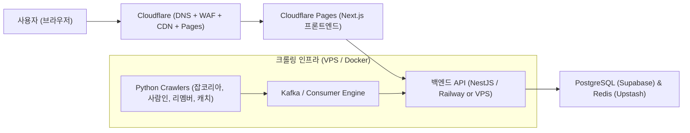

# [검토 보고서] Cloudflare(클라우드플레어) 적합성 검토 및 아키텍처 적용 방안

## 1. 종합 결론: "적극 추천 (프론트엔드/CDN/보안/DB 캐싱에 최상)"

Cloudflare는 본 프로젝트(통합 채용 플랫폼)의 **비용 절감, 전세계/국내 초고속 전송, DDoS 방어, 봇 탐지 우회(보안 프록시)** 측면에서 최고의 선택지 중 하나입니다. 특히 초기 자본이 적은 상황에서 **무료 티어 혜택이 압도적**입니다.

---

## 2. 영역별 Cloudflare 활용 매핑

| 구성 요소 | 기존 제안 | Cloudflare 적용 방안 | 도입 효과 및 장점 |
| :--- | :--- | :--- | :--- |
| **프론트엔드 호스팅** | Vercel | **Cloudflare Pages** | **완전 무료** 대역폭(Bandwidth 무제한), GitHub 연동 자동 빌드/배포, Next.js 풀스택 SSR 지원 |
| **도메인 & DNS & SSL** | 가비아 / Route53 | **Cloudflare DNS & Registrar** | 세계에서 가장 빠른 DNS, 원클릭 무료 와일드카드 SSL 인증서, 도메인 도매가 등록 |
| **CDN & 정적 캐싱** | AWS CloudFront | **Cloudflare CDN** | 공고 상세, 기업 로고 이미지, 정적 에셋 무제한 무료 캐싱, 로딩 속도 10배 개선 |
| **엣지 함수 / 서버리스** | AWS Lambda | **Cloudflare Workers** | 전 세계 엣지에서 0ms 콜드스타트로 실행. IP 차단 방지용 경량 프록시, API 캐싱 레이어로 활용 |
| **엣지 DB / 캐시** | Redis / Upstash | **Cloudflare D1 (SQL) & KV** | 글로벌 분산 캐시 및 임시 토큰 저장소로 무상/초저비용 활용 가능 |
| **보안 & DDoS 방어** | AWS WAF | **Cloudflare WAF & Bot Management** | 무차별 대입 공격 차단, 커뮤니티 어뷰징 방어, 기본 DDoS 무료 방어 |

---

## 3. 한계점 및 주의사항 (서버가 별도로 필요한 부분)

Cloudflare가 아무리 뛰어나도 **모든 것을 다 대체할 수는 없습니다.** 다음 항목은 별도 인프라를 유지해야 합니다:

1. **상시 실행 백그라운드 크롤러 (Playwright/Python)**:
   * Cloudflare Workers는 요청당 실행 시간 제한(CPU 타임 제한)이 있어, 무거운 브라우저 기반 크롤러를 24시간 띄울 수 없습니다.
   * **대응책**: 크롤러와 Kafka 파이프라인은 앞서 제안한 **Hetzner VPS(월 5천원)** 또는 **Oracle Free Tier VM**에서 Docker로 구동.
2. **복잡한 관계형 트랜잭션 DB**:
   * 대용량 정규화 공고 저장, 복잡한 인덱스 검색은 **Supabase(PostgreSQL)**를 메인 DB로 사용하고, Cloudflare는 그 앞단의 CDN/캐시 레이어로 배치하는 것이 가장 안정적입니다.

---

## 4. 최종 추천 하이브리드 아키텍처

* **비용 절감 효과**: 프론트엔드 트래픽/대역폭 비용 **0원** (무제한)
* **안정성**: DDoS 방어 및 SSL 자동 갱신 기본 탑재
* **운영 편의성**: GitHub Push 시 Cloudflare Pages가 자동 빌드 및 배포
