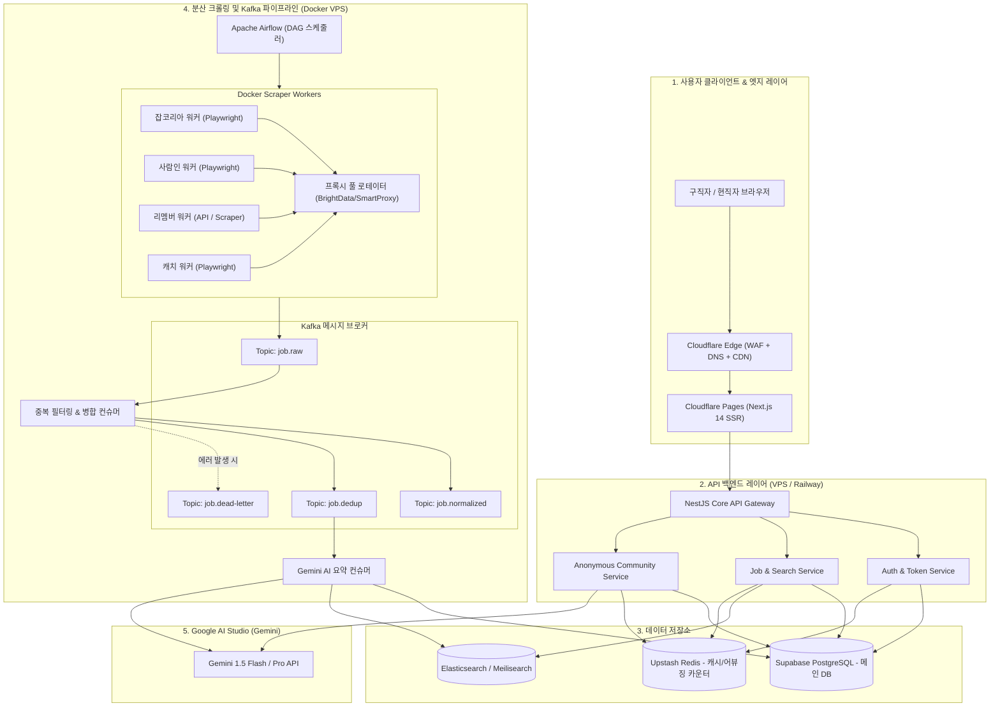

# [기술 명세서] 01. 시스템 아키텍처 및 데이터 파이프라인 스펙

## 1. 전체 엔드투엔드 토폴로지



---

## 2. Kafka 토픽 및 메시지 페이로드 스펙

### 2.1 토픽 설계
| 토픽명 | 파티션 수 | 보관 기간(Retention) | 생산자(Producer) | 소비자(Consumer) |
| :--- | :---: | :---: | :--- | :--- |
| `job.raw` | 4 | 24시간 | 개별 스크래퍼 워커 | 정규화/중복제거 컨슈머 |
| `job.dedup` | 4 | 7일 | 중복제거 컨슈머 | DB 적재 및 AI 요약 워커 |
| `job.dead-letter` | 1 | 30일 | 예외 발생 컨슈머 | 관리자 오류 분석 시스템 |

### 2.2 메시지 스키마 예시 (`job.raw`)
```json
{
  "traceId": "crawling-jk-20260904-00129",
  "sourcePlatform": "jobkorea",
  "sourceUrl": "https://www.jobkorea.co.kr/Recruit/GI_Read/4512345",
  "sourceJobId": "4512345",
  "rawPayload": {
    "companyNameRaw": "(주)쿠팡",
    "titleRaw": "백엔드 개발자 (Python/Django)",
    "locationRaw": "서울 송파구 송파대로 570",
    "salaryRaw": "회사내규에 따름 (면접 후 협의)",
    "deadlineRaw": "2026.09.30",
    "descriptionHtml": "<div>...</div>"
  },
  "crawledAt": "2026-09-04T18:30:00Z"
}
```

---

## 3. 크롤러 컨테이너 및 프록시 로테이션 스펙

1. **Docker 컨테이너 격리**:
   * 각 플랫폼(잡코리아, 사람인, 리멤버, 캐치)을 별도의 Docker Service로 분리.
   * 메모리 누수 방지를 위해 브라우저 인스턴스는 50회 페이지 수집 후 재시작(Graceful Restart).
2. **프록시 로테이션 프로토콜**:
   * 크롤러가 직접 타깃 서버에 접속하지 않고 로컬 `squid` 또는 프록시 게이트웨이를 경유.
   * `403 Forbidden` 또는 `429 Too Many Requests` 수신 시 해당 IP 30분 쿨다운 및 즉시 타 IP 대체.
3. **셀렉터 동적 로딩**:
   * 크롤러는 하드코딩된 선택자를 사용하지 않고 `redis://scrapers:config:{platform}` 또는 로컬 `YAML`을 읽어 실행.
