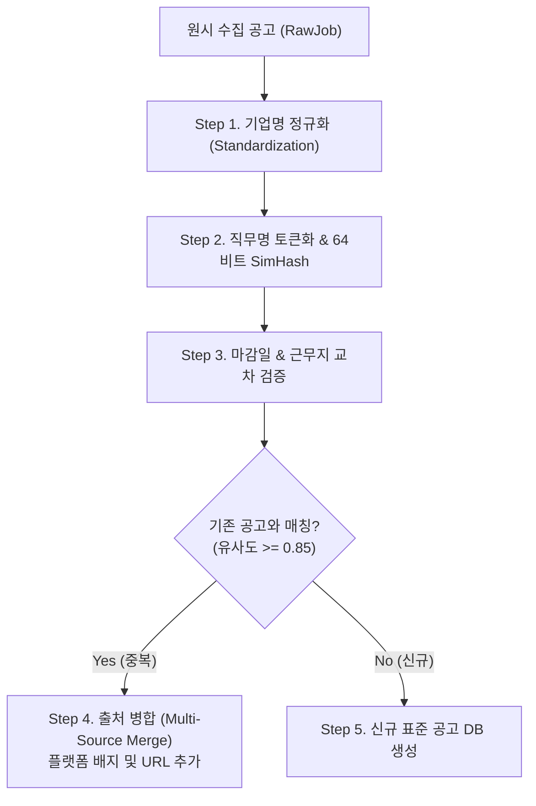

# [기술 명세서] 02. 중복 공고 필터링 및 익명 보안 알고리즘 명세

## 1. 중복 공고 필터링 및 교차 병합 알고리즘 (Deduplication Engine)

### 1.1 중복 감지 3단계 파이프라인



### 1.2 상세 알고리즘 수식 및 로직

#### Step 1: 기업명 정규화 (Company Normalization)
* 법인격 표기 제거: `(주)`, `주식회사`, `(유)`, `(사)` 등의 정규식 패턴 제거.
* 공백 및 영문 케이스 통일: 공백 제거, 소문자화(`Coupang Corp` ➡️ `coupang`).
* 별칭 딕셔너리 매핑: `우아한형제들` ➡️ `배달의민족`, `비바리퍼블리카` ➡️ `토스`.

```python
import re

def normalize_company(raw_name: str) -> str:
    cleaned = re.sub(r"\(주\)|주식회사|\(유\)|\(사\)", "", raw_name)
    cleaned = re.sub(r"[\s\-_.,]", "", cleaned).strip().lower()
    # 별칭 매핑 테이블 조회
    alias_map = {"우아한형제들": "배달의민족", "비바리퍼블리카": "토스"}
    return alias_map.get(cleaned, cleaned)
```

#### Step 2: 직무명 64-bit SimHash 유사도
* 직무 타이틀(예: `[쿠팡] 백엔드 개발자 (Python/Django) 채용`)에서 불필요한 태그 제거.
* 2-gram 단어 토큰 분리 후 64비트 SimHash 지문(Fingerprint) 계산.
* 해밍 거리(Hamming Distance)가 3 이하일 경우 유사도 85% 이상으로 판단.

$$\text{Similarity}(H_1, H_2) = 1 - \frac{\text{HammingDistance}(H_1, H_2)}{64}$$

#### Step 3: 마감일 버킷 검증 (Deadline Window)
* 채용 공고 마감일이 상시 채용이거나, 수집일 기준 $\pm 3$일 이내에 위치하면 동일 건으로 채택.

#### Step 4: 멀티소스 병합 (Cross-Platform Merging)
* 이미 DB에 존재하는 공고일 경우, 기존 공고의 `sources` JSON 필드에 현재 수집 플랫폼 정보만 추가:
```json
{
  "sources": [
    {"platform": "jobkorea", "url": "https://jobkorea...", "crawledAt": "2026-09-04"},
    {"platform": "saramin", "url": "https://saramin...", "crawledAt": "2026-09-04"}
  ]
}
```

---

## 2. 익명 보안 아키텍처 및 토큰화 알고리즘 (Zero-Knowledge Anonymous Spec)

### 2.1 익명성 보장 3단계 해시 알고리즘

구직자가 커뮤니티에 글이나 댓글을 작성할 때, **관리자를 포함한 그 누구도 작성자를 역추적할 수 없도록** 단방향 해싱을 수행합니다.

$$Token_{\text{anon}} = \text{HMAC-SHA256}(UserUUID, \text{GlobalPepper} \oplus \text{DailySalt})$$

* **UserUUID**: 사용자 가입 시 부여되는 난수 식별자.
* **GlobalPepper**: 서버 환경변수에만 보관되며 DB에 절대 적재되지 않는 마스터 키.
* **DailySalt**: 매일 자정에 순환되는 일회성 솔트 (글 작성 시점의 시간 추적 방어).

```typescript
import { createHmac } from 'crypto';

export function generateAnonymousToken(userUuid: string, dailySalt: string): string {
  const pepper = process.env.ANON_GLOBAL_PEPPER!;
  const secret = Buffer.from(pepper).map((b, i) => b ^ (dailySalt.charCodeAt(i % dailySalt.length) || 0));
  return createHmac('sha256', secret).update(userUuid).digest('hex');
}
```

### 2.2 사용자 본인 글 조회 메커니즘 (Ownership Verification)
* DB의 `posts` 테이블에는 `author_token`만 기록되어 있어 역추적이 불가능함.
* 사용자가 '마이페이지'에서 본인이 작성한 글을 조회할 때:
  1. 클라이언트가 세션 JWT를 들고 `/me/posts` 요청.
  2. 서버가 해당 유저의 `UserUUID`와 저장된 솔트 목록으로 토큰들을 재생성.
  3. `SELECT * FROM posts WHERE author_token IN (...)` 쿼리로 본인 글만 반환.
  * **결과**: 유저 본인은 편리하게 자신의 글을 관리할 수 있으나, DB 전체가 해킹당해도 사용자 ID와 글을 결합할 수 없음.
