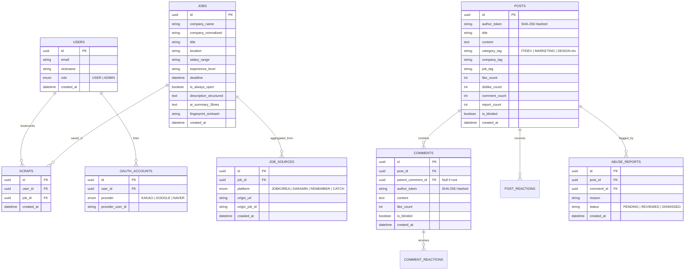

# [기술 명세서] 03. 데이터베이스 ERD 및 REST API 명세

## 1. 데이터베이스 ERD (Entity Relationship Diagram)



---

## 2. 핵심 REST API 명세서

### 2.1 공고 뷰어 API (Job Viewer)
| Method | Endpoint | 설명 | 인증 |
| :--- | :--- | :--- | :---: |
| `GET` | `/api/v1/jobs` | 통합 공고 목록 조회 (필터, 검색, 정렬, 커서 페이지네이션) | 불필요 |
| `GET` | `/api/v1/jobs/:id` | 공고 상세 조회 (출처 목록 및 Gemini 3줄 요약 포함) | 불필요 |
| `POST` | `/api/v1/jobs/:id/scrap` | 공고 북마크/스크랩 등록 및 취소 토글 | 필요 (JWT) |

#### 공고 목록 응답 예시
```json
{
  "data": [
    {
      "id": "c8b1a3d0-1234-5678-9abc-def012345678",
      "companyName": "쿠팡",
      "title": "백엔드 개발자 (Python/Django)",
      "location": "서울 송파구",
      "salaryRange": "연봉 6,000 ~ 9,000만원",
      "experienceLevel": "경력 3~7년",
      "deadline": "2026-09-30T23:59:59Z",
      "dDay": 26,
      "sources": ["JOBKOREA", "SARAMIN", "CATCH"],
      "isScrapped": false
    }
  ],
  "nextCursor": "eyJob2JfaWQiOiJjOGIx..."
}
```

### 2.2 익명 커뮤니티 API (Anonymous Community)
| Method | Endpoint | 설명 | 인증 |
| :--- | :--- | :--- | :---: |
| `GET` | `/api/v1/posts` | 커뮤니티 글 목록 (태그, 정렬: 최신/인기/댓글순) | 불필요 |
| `GET` | `/api/v1/posts/:id` | 게시글 상세 및 대댓글 스레드 트리 조회 | 불필요 |
| `POST` | `/api/v1/posts` | 익명 글 작성 (서버에서 author_token 단방향 생성) | 필요 (JWT) |
| `POST` | `/api/v1/posts/:id/comments` | 익명 댓글/대댓글 등록 | 필요 (JWT) |
| `POST` | `/api/v1/posts/:id/react` | 좋아요/싫어요 반응 (type: LIKE | DISLIKE) | 필요 (JWT) |
| `POST` | `/api/v1/posts/:id/report` | 어뷰징 신고 접수 (사유 기재) | 필요 (JWT) |

### 2.3 사용자 및 마이페이지 API (User & MyPage)
| Method | Endpoint | 설명 | 인증 |
| :--- | :--- | :--- | :---: |
| `POST` | `/api/v1/auth/social/:provider` | 소셜 로그인 토큰 검증 및 JWT 발급 | 불필요 |
| `GET` | `/api/v1/me/profile` | 내 프로필 및 활동 통계 (스크랩 수, 작성글 수) | 필요 (JWT) |
| `GET` | `/api/v1/me/scraps` | 내가 스크랩한 공고 목록 조회 | 필요 (JWT) |
| `GET` | `/api/v1/me/posts` | 내가 작성한 익명 글 목록 조회 (서버 재해시 조회) | 필요 (JWT) |
