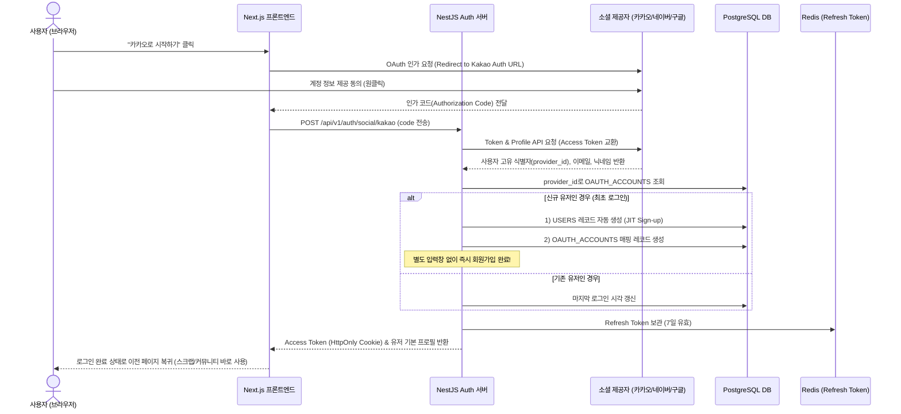

# [기술 명세서] 04. 카카오·네이버·구글 소셜 로그인 및 통합 회원 관리 아키텍처

## 1. 개요 및 설계 철학
* **목표**: 별도의 비밀번호 설정이나 이메일 인증 절차 없이, 사용자가 보유한 **카카오 / 네이버 / 구글 계정으로 원클릭(3초) 즉시 회원가입 및 로그인**을 완료할 수 있도록 구현.
* **JIT 프로비저닝 (Just-In-Time Provisioning)**:
  * 첫 OAuth 콜백 수신 시점에 DB에 해당 유저가 없으면 **백그라운드에서 즉시 `users`와 `oauth_accounts` 테이블에 레코드를 자동 생성**하고 JWT 세션을 발급.
  * 사용자는 "가입 페이지"를 거치지 않고 곧바로 공고 스크랩이나 커뮤니티 활동 가능.

---

## 2. 3대 소셜 로그인 제공자별 데이터 규격

| 제공자 | 주요 취득 정보 | 특징 및 권한 설정 | 장점 |
| :--- | :--- | :--- | :--- |
| **카카오 (Kakao)** | `id`, `kakao_account.email`, `properties.nickname`, `properties.profile_image` | 국내 모바일 사용자 접근성 최상. 카카오싱크 간편가입 연동 지원 | 국내 20~40대 구직자 이탈률 최저 |
| **네이버 (Naver)** | `response.id`, `response.email`, `response.name`, `response.profile_image` | 네이버 로그인 오픈API (OAuth 2.0 기반) | 직장인 및 PC 사용자층 두터움 |
| **구글 (Google)** | `sub`, `email`, `name`, `picture` | Google Identity Services (원클릭 Google One Tap 연동 가능) | IT/개발자 직군 선호도 1위 |

---

## 3. 원클릭 가입 및 세션 발급 시퀀스 (OAuth 2.0 Flow)



---

## 4. 통합 회원 데이터베이스 스키마 설계

사용자가 다른 소셜 계정으로 로그인해도 이메일이 동일할 경우 계정을 연동하거나 분리할 수 있도록 **1:N 계정 구조**로 설계합니다.

```sql
-- 1. 통합 사용자 기본 테이블
CREATE TABLE users (
    id UUID PRIMARY KEY DEFAULT gen_random_uuid(),
    email VARCHAR(255) UNIQUE,                  -- 소셜 제공자에서 수신한 이메일
    nickname VARCHAR(50) NOT NULL,               -- 소셜 닉네임 또는 자동생성된 닉네임
    profile_image_url TEXT,                      -- 소셜 프로필 이미지
    role VARCHAR(20) DEFAULT 'USER',             -- USER, ADMIN
    status VARCHAR(20) DEFAULT 'ACTIVE',         -- ACTIVE, SUSPENDED, WITHDRAWN
    created_at TIMESTAMP WITH TIME ZONE DEFAULT NOW(),
    updated_at TIMESTAMP WITH TIME ZONE DEFAULT NOW()
);

-- 2. 소셜 제공자 매핑 테이블 (1명의 유저가 여러 소셜 계정을 연결 가능)
CREATE TABLE oauth_accounts (
    id UUID PRIMARY KEY DEFAULT gen_random_uuid(),
    user_id UUID NOT NULL REFERENCES users(id) ON DELETE CASCADE,
    provider VARCHAR(20) NOT NULL,               -- 'KAKAO', 'NAVER', 'GOOGLE'
    provider_user_id VARCHAR(255) NOT NULL,      -- 소셜 제공자가 부여한 고유 불변 ID
    access_token TEXT,                           -- 필요 시 암호화 보관
    refresh_token TEXT,
    connected_at TIMESTAMP WITH TIME ZONE DEFAULT NOW(),
    UNIQUE(provider, provider_user_id)
);

CREATE INDEX idx_oauth_provider_id ON oauth_accounts(provider, provider_user_id);
```

---

## 5. 익명 커뮤니티와의 안전한 연결고리 (프라이버시 분리)

* 소셜 로그인으로 회원 식별은 확실하게 하되, 커뮤니티에서는 신원이 노출되지 않아야 합니다.
* `user_id`를 직접 사용하지 않고 앞서 설계한 **`HMAC-SHA256(user_id, salt)` 토큰**을 생성하여 글을 작성하므로, **카카오/구글 프로필 정보는 커뮤니티 DB로 일절 전파되지 않습니다.**

---

## 6. 프론트엔드 연동 라이브러리 추천

1. **NextAuth.js (Auth.js v5)**:
   * Next.js 14 App Router와 완벽 호환.
   * `KakaoProvider`, `GoogleProvider`, `NaverProvider`를 내장하고 있어 설정 10줄 이내로 소셜 버튼 연동 완료.
   * 세션 토큰 자동 갱신 및 암호화 쿠키 기본 지원.
