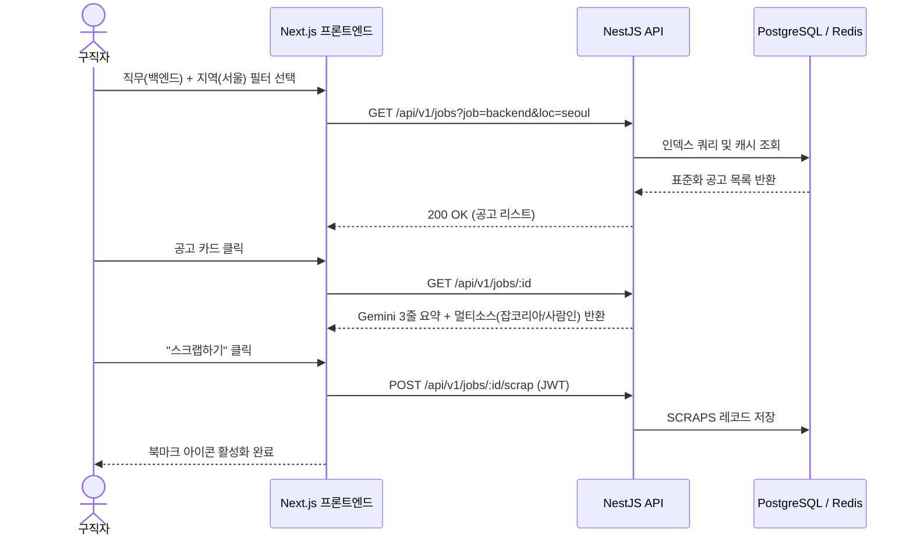
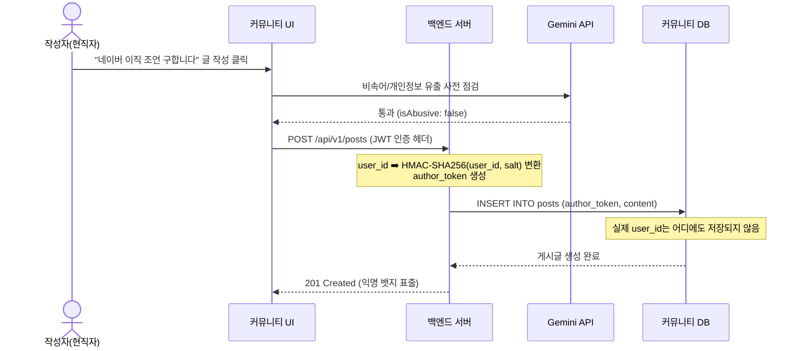

# [UI/UX 기획안] 01. 정보구조도(IA) 및 사용자 인터랙션 플로우

## 1. 사이트 정보구조도 (Information Architecture - Sitemap)

```
[JobConnect 메인 루트]
├── 1.0 랜딩 / 홈 (Landing Page)
│   ├── 통합 검색창 (키워드/기업/직무)
│   ├── 실시간 수집 통계 배너
│   ├── 연동 플랫폼 소개 (잡코리아/사람인/리멤버/캐치)
│   └── 간편 소셜 로그인 (카카오/구글/네이버)
│
├── 2.0 채용공고 큐레이션 (Job Curator)
│   ├── 2.1 공고 통합 검색/목록 뷰어
│   │   ├── 다중 조건 필터 패널 (직무, 지역, 경력, 마감일)
│   │   └── 표준화 공고 카드 그리드 (멀티플랫폼 뱃지, D-day)
│   └── 2.2 공고 상세 뷰 (Job Detail)
│       ├── Gemini AI 3줄 핵심 요약 위젯
│       ├── 표준 구조화 상세 요강 (자격, 우대, 근무지, 연봉)
│       ├── 멀티플랫폼 원본 바로가기 탭
│       └── 공고 스크랩 토글 버튼
│
├── 3.0 하이브리드 익명 커뮤니티 (Anonymous Community)
│   ├── 3.1 토픽별 피드 목록
│   │   ├── 인기 해시태그 바 (#이직고민, #연봉협상 등)
│   │   ├── 카테고리 탭 (전체, IT/개발, 마케팅, 디자인, 금융, 스타트업)
│   │   └── 정렬 필터 (최신순, 인기순, 댓글순)
│   ├── 3.2 게시글 상세 및 스레드
│   │   ├── 익명 게시글 본문 및 직무/연차 태그
│   │   ├── 좋아요/싫어요/신고 상호작용
│   │   └── 무한 계층 대댓글 스레드
│   └── 3.3 익명 글 작성 모달
│       ├── 직무/연차 선택
│       └── Gemini AI 어뷰징 실시간 프리체크
│
├── 4.0 마이페이지 (MyPage)
│   ├── 4.1 스크랩 보관함 (마감일 순 정렬, 일괄 삭제)
│   ├── 4.2 내 익명 작성글/댓글 관리
│   └── 4.3 연동 소셜 계정 관리 및 로그아웃
│
└── 5.0 관리자 콘솔 (Admin Console)
    ├── 5.1 크롤링 실시간 모니터링 (성공률, 수집량, 에러로그)
    ├── 5.2 셀렉터 핫픽스 패널 (YAML 편집)
    └── 5.3 신고된 게시글 블라인드 심사
```

---

## 2. 핵심 사용자 시나리오 플로우차트

### 2.1 공고 탐색 및 스크랩 플로우


### 2.2 익명 커뮤니티 작성 및 보안 플로우

