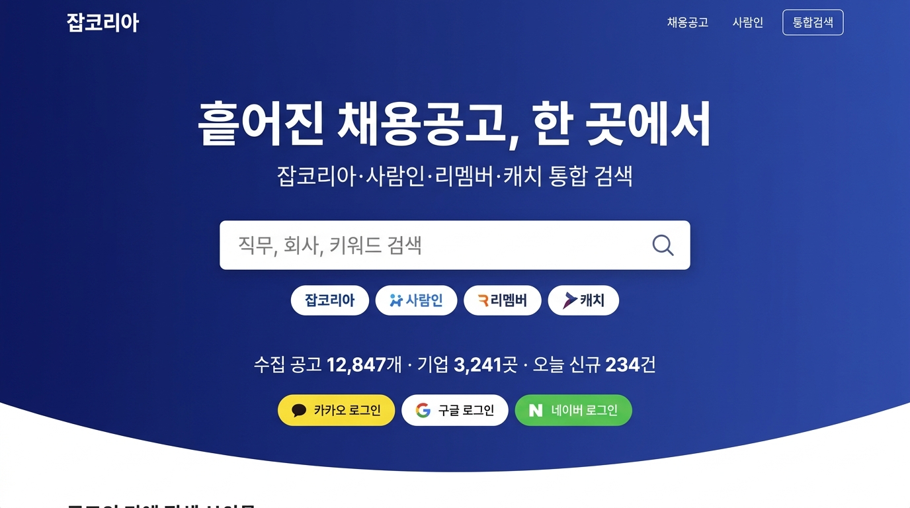
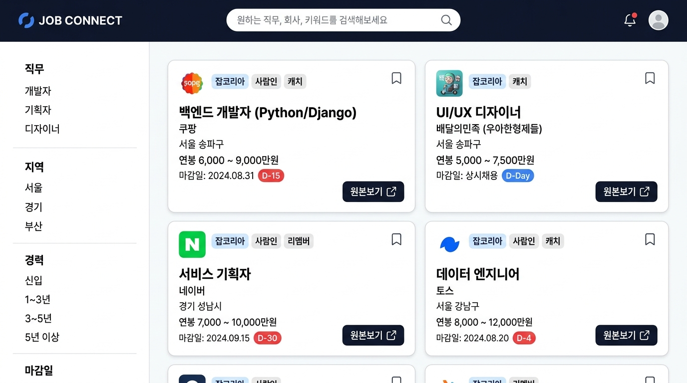
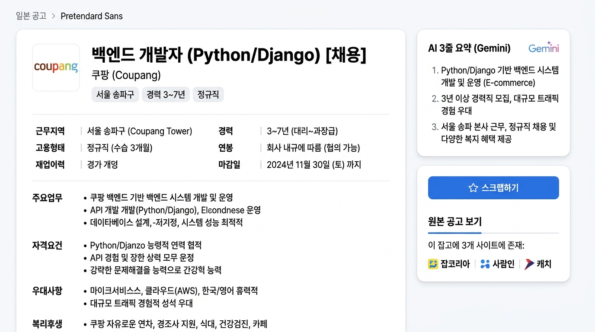
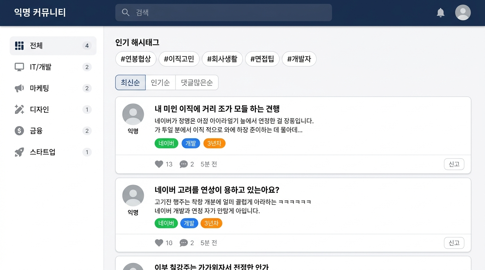
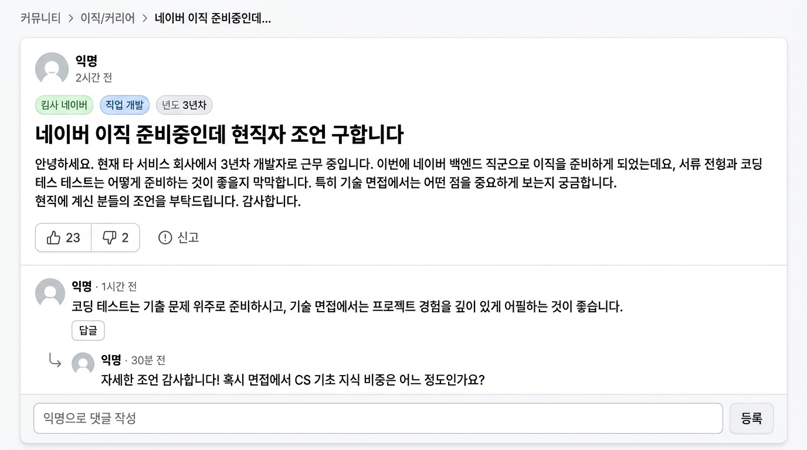
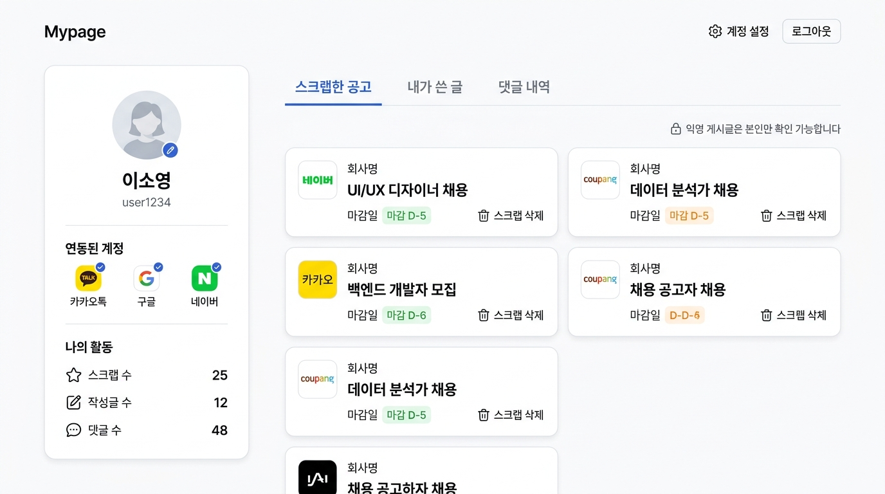
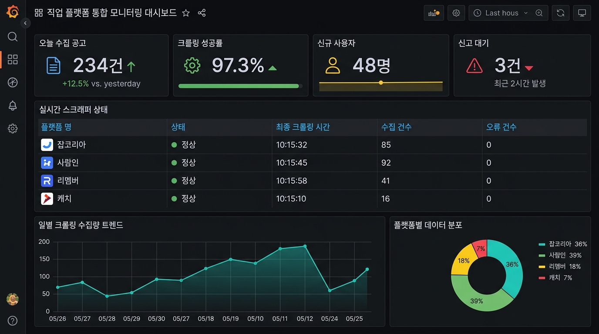

# [UI/UX 기획안] 02. 화면별 정밀 스토리보드 및 와이어프레임 명세

본 문서는 Google AI Studio(Imagen)를 통해 기획·생성된 7종의 핵심 UI 화면과 각 화면별 상세 컴포넌트 명세, 사용자 인터랙션 및 예외 처리 로직을 정의합니다.

---

## 1. 랜딩 페이지 (Landing Page)

### 1.1 화면 개요 및 목적
* 비로그인 사용자 및 신규 방문자가 플랫폼의 차별점(4개 플랫폼 통합 수집)을 즉각 인지하고 검색 및 소셜 로그인을 유도하는 첫 진입 화면.

### 1.2 주요 컴포넌트 및 인터랙션
1. **히어로 헤드라인**:
   * 대형 헤드라인: "흩어진 채용공고, 한 곳에서" / 서브타이틀: "잡코리아·사람인·리멤버·캐치 통합 검색"
2. **통합 검색창 (Hero Search Bar)**:
   * 입력창 포커스 시 실시간 최근 검색어 및 추천 키워드 드롭다운 표출.
   * `Enter` 또는 돋보기 클릭 시 공고 목록 뷰어로 키워드 파라미터 전달 이동 (`/jobs?q=...`).
3. **연동 플랫폼 뱃지**:
   * 잡코리아, 사람인, 리멤버, 캐치 로고 칩 표출.
4. **실시간 통계 바**:
   * "수집 공고 12,847개 · 기업 3,241곳 · 오늘 신규 234건" 실시간 집계 수치 카운팅 애니메이션.
5. **소셜 로그인 CTA 버튼**:
   * 카카오톡(Yellow), 구글(White), 네이버(Green) 원클릭 OAuth 로그인 연동.

---

## 2. 채용 공고 목록 뷰어 (Job Listing Viewer)

### 2.1 주요 컴포넌트 및 인터랙션
1. **좌측 다차원 필터 사이드바 (Filter Sidebar)**:
   * **직무**: 개발자, 기획자, 디자이너 등 트리형 다중 체크박스.
   * **지역**: 서울, 경기, 인천, 부산 등 시/도 단위 필터.
   * **경력**: 신입, 1~3년, 3~5년, 5년 이상 다중 선택.
   * **마감일**: 마감 임박순 정렬 라디오 버튼.
2. **표준화 공고 카드 (Standardized Job Card)**:
   * **상단 헤더**: 회사 로고 + 출처 플랫폼 뱃지 (예: `잡코리아`, `사람인`, `캐치`가 병합된 배지 표출).
   * **북마크 버튼**: 우측 상단 책갈피 아이콘. 클릭 시 로그인 상태 확인 후 즉시 북마크 토글.
   * **본문**: 굵은 직무명(`백엔드 개발자 (Python/Django)`), 기업명(`쿠팡`), 근무지, 예상 연봉 범위.
   * **D-day 뱃지**: 마감일 $\le 5$일이면 적색(`D-4`), $\le 15$일이면 주황색, 상시채용은 청색 표출.
   * **원본보기 버튼**: 클릭 시 새 창에서 원본 채용 사이트 공고 URL로 아웃링크 연결.
3. **페이징 및 인피니티 스크롤**:
   * 무한 스크롤(Intersection Observer)을 적용하여 하단 도달 시 20건씩 자동 로드.

---

## 3. 채용 공고 상세 뷰어 (Job Detail Viewer)

### 3.1 주요 컴포넌트 및 인터랙션
1. **Gemini AI 3줄 요약 박스 (우측 상단)**:
   * Google AI Studio 연동 컴포넌트.
   * 복잡한 요강을 `1. 주요 기술 스택`, `2. 경력/자격 조건`, `3. 근무 형태 및 복지` 3개 불릿으로 간결화하여 제공.
2. **구조화된 채용 요강 테이블 (좌측 메인)**:
   * 비정형 원본 텍스트를 파싱하여 `주요업무`, `자격요건`, `우대사항`, `복리후생` 섹션별로 분리 정돈.
3. **원본 공고 보기 탭 (Sticky Sidebar)**:
   * 이 공고가 여러 플랫폼에서 수집된 경우, 탭 형태로 `잡코리아 | 사람인 | 캐치` 버튼을 나열.
   * 클릭 시 사용자가 선호하는 플랫폼의 원본 링크로 바로 이동.
4. **스크랩하기 CTA**:
   * 상시 고정(Sticky) 버튼으로 스크랩 여부 토글.

---

## 4. 익명 커뮤니티 게시판 (Anonymous Community Board)

### 4.1 주요 컴포넌트 및 인터랙션
1. **인기 해시태그 바 (Trending Tags)**:
   * `#이직고민`, `#연봉협상`, `#회사생활`, `#면접팁`, `#개발자` 등 클릭 시 해당 해시태그 필터링 피드 전환.
2. **카테고리 네비게이션**:
   * 전체, IT/개발, 마케팅, 디자인, 금융, 스타트업 탭.
3. **피드 정렬 스위처**:
   * `최신순`, `인기순(좋아요 많은순)`, `댓글많은순`.
4. **익명 포스트 카드**:
   * 작성자 프로필: 항상 통일된 회색 실루엣 아바타와 `익명` 텍스트.
   * 직무/연차 칩: 예: `네이버` `개발` `3년차` 컬러 칩 표시.
   * 반응 카운터: 하트(좋아요), 말풍선(댓글), 작성 시점(예: 5분 전), 우측 `신고` 버튼.

---

## 5. 커뮤니티 게시글 상세 및 대댓글 스레드 (Post Detail)

### 5.1 주요 컴포넌트 및 인터랙션
1. **게시글 본문 영역**:
   * 브레드크럼(`커뮤니티 > 이직/커리어 > 본문 제목`).
   * 제목 및 상세 본문 텍스트.
   * 좋아요/싫어요 카운터 및 신고 버튼.
2. **대댓글 중첩 스레드 (Nested Comment Thread)**:
   * 부모 댓글: 아바타, 익명 라벨, 작성 시간, 내용, `답글` 버튼.
   * 자식 댓글(대댓글): 화살표(↳) 인덴트 표기를 통해 계층 구조 시각화.
3. **하단 고정 댓글 입력창**:
   * "익명으로 댓글 작성" 플레이스홀더.
   * 등록 클릭 시 실시간 낙관적 업데이트(Optimistic Update)로 즉각 화면 반영.

---

## 6. 마이페이지 (MyPage)

### 6.1 주요 컴포넌트 및 인터랙션
1. **프로필 카드 (좌측)**:
   * 소셜 로그인 연동 상태 뱃지 (카카오, 구글, 네이버).
   * 활동 통계 요약: 스크랩 수, 작성글 수, 작성 댓글 수 카운트.
2. **3개 메인 탭 (우측)**:
   * **[스크랩한 공고]**: 보관한 공고를 2열 그리드로 표시, `스크랩 삭제` 버튼 제공.
   * **[내가 쓴 글]**: 본인이 작성한 익명 글 목록 (보안 토큰을 기반으로 본인만 조회).
   * **[댓글 내역]**: 내가 남긴 댓글과 해당 원문 링크.
3. **보안 안내 고지**:
   * "🔒 익명 게시글은 본인만 확인 가능합니다 (암호화 보호 중)" 안내 박스.

---

## 7. 관리자 모니터링 대시보드 (Admin Dashboard)

### 7.1 주요 컴포넌트 및 인터랙션
1. **상단 핵심 KPI 카드**:
   * 오늘 수집 공고 (건수 및 전일 대비 증감율).
   * 크롤링 성공률 (97.3% 등 백분율 및 정상 상태 인디케이터).
   * 신규 가입자 수 / 누적 신고 대기 건수.
2. **실시간 스크래퍼 헬스체크 테이블**:
   * 플랫폼명(잡코리아, 사람인, 리멤버, 캐치).
   * 상태 인디케이터(초록: 정상, 빨강: 오류/차단).
   * 최종 크롤링 시각, 수집 건수, 에러 건수.
3. **추이 차트**:
   * 일별 수집량 트렌드 라인 차트.
   * 플랫폼별 수집 비중 도넛 차트.
